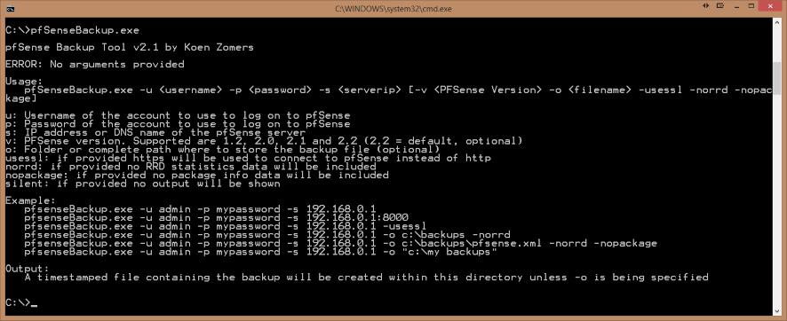
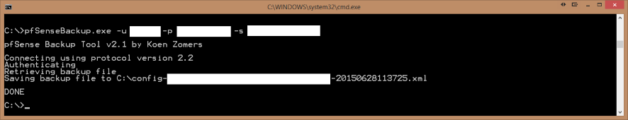

# pfSenseBackup

This is a modified structure of the open source pfSenseBackup project by KoenZomers.  This structure only contains the documentation and the latest release build, pfSenseBackup.exe version 2.4.3.  For complete source code, visit the project's official Github page. 

[https://github.com/KoenZomers/pfSenseBackup](https://github.com/KoenZomers/pfSenseBackup)

pfSense Backup allows you to backup the complete configuration of your pfSense server using this command line Windows application. It is easy to include this in a larger script for your backups and schedule it i.e. with the Windows Task Scheduler. It supports pfSense installations running at least pfSense version 1.2 up to the most recent pfSense version 2.4.

[Version History](https://github.com/KoenZomers/pfSenseBackup/blob/master/VersionHistory.md)

## System Requirements

This tool requires the Microsoft .NET 4.6 framework to be installed on your Windows client or Windows server operating system. For a full list of operating systems on which this framework can be installed, see: https://msdn.microsoft.com/en-us/library/8z6watww(v=vs.110).aspx. Basically it can be installed on Windows Vista SP2 or later or Windows Server 2008 SP2 or later.

## Usage Instructions

1. Copy pfSenseBackup.exe to any location on a Windows machine where you want to use the tool
2. Run pfSenseBackup.exe to see the command line options
3. Run pfSenseBackup.exe with the appropriate command line options to connect to your pfSense server and download the backup

## Feedback

Any kind of feedback is welcome! Feel free to drop me an e-mail at mail@koenzomers.nl
